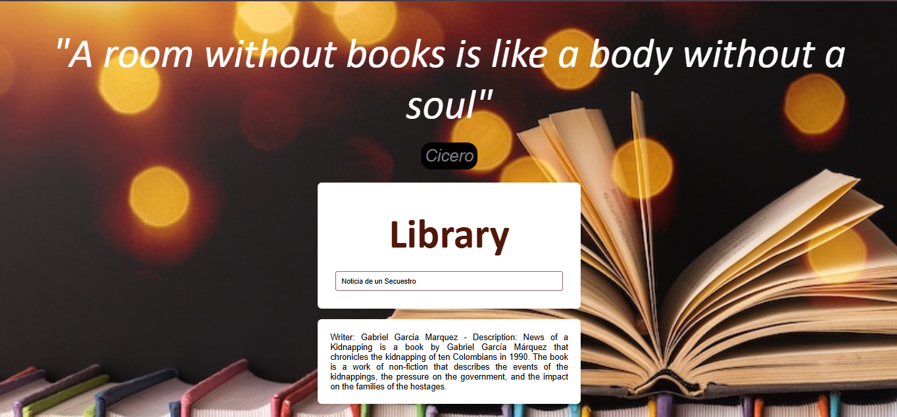

# LIBRARY

In this project, I used technologies such as Javascript, HTML, and CSS to create a search list, which allows users to find information such as writer and description according to the book they selected.
I used an input where the user can write. According to this, the program brings users similar results to their search, and he/she can select one to learn who wrote the book and a short description about it.

To visit this page you can click this link **https://lauravargas22.github.io/Library/**